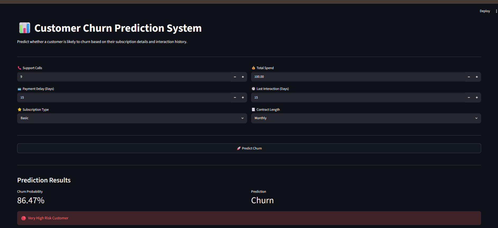
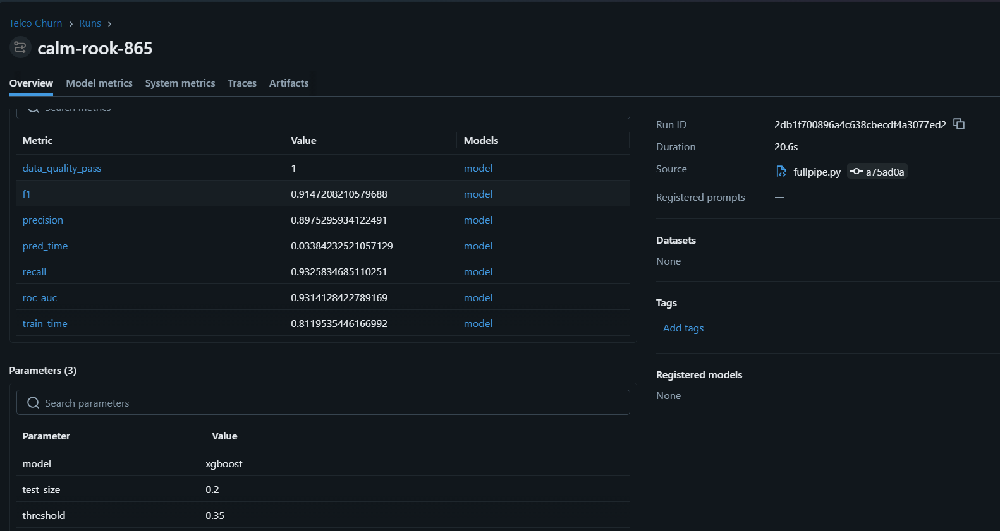
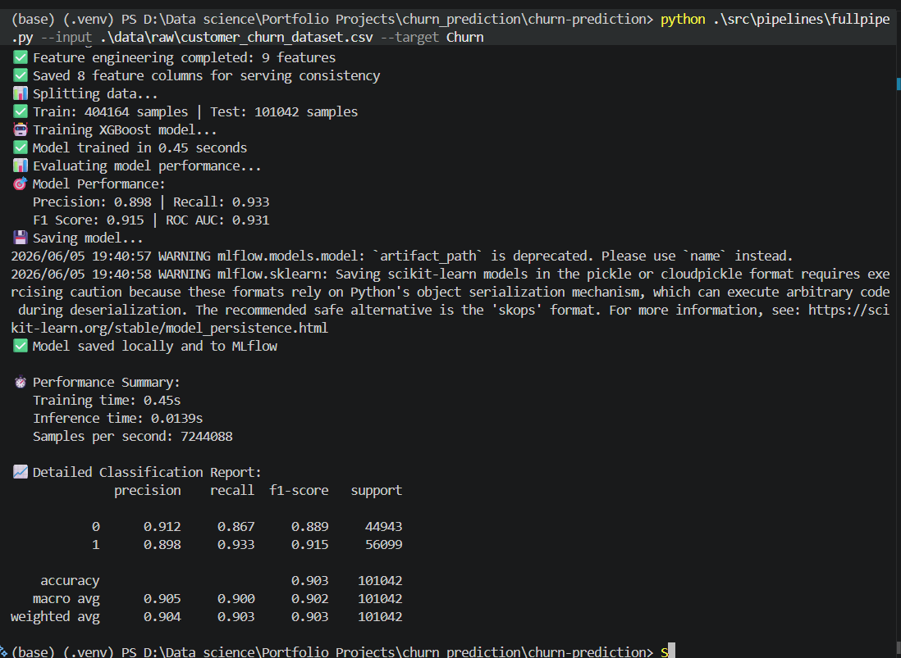
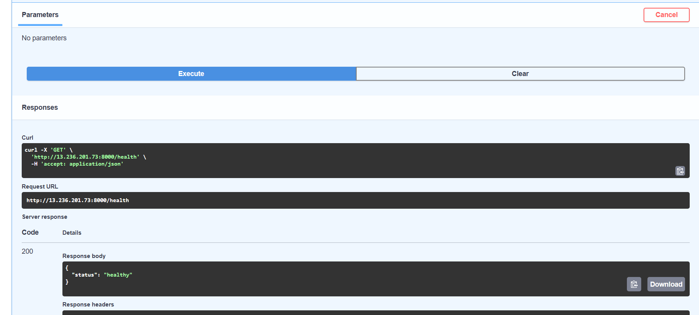
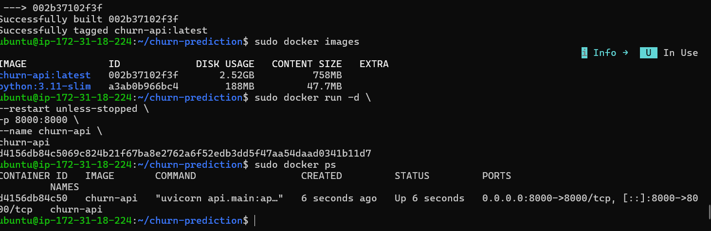
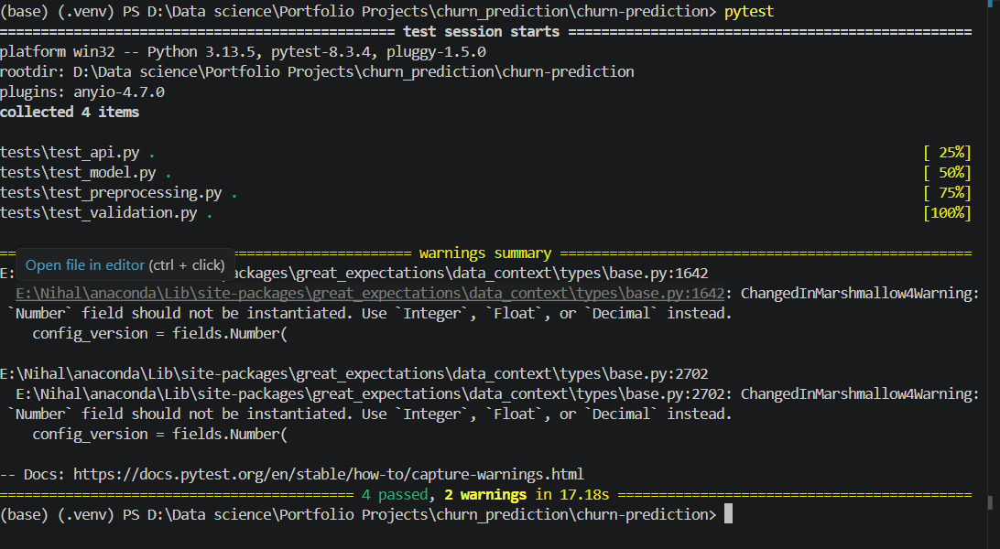
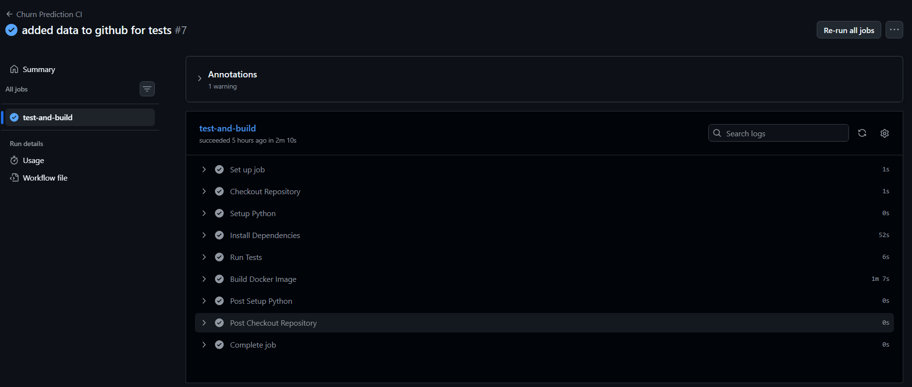
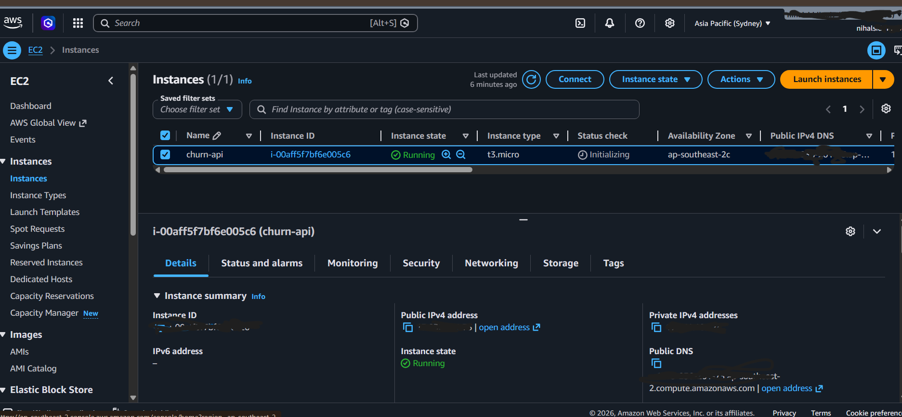
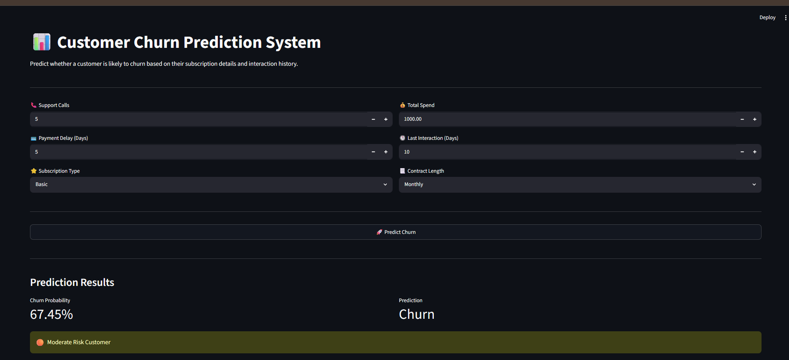
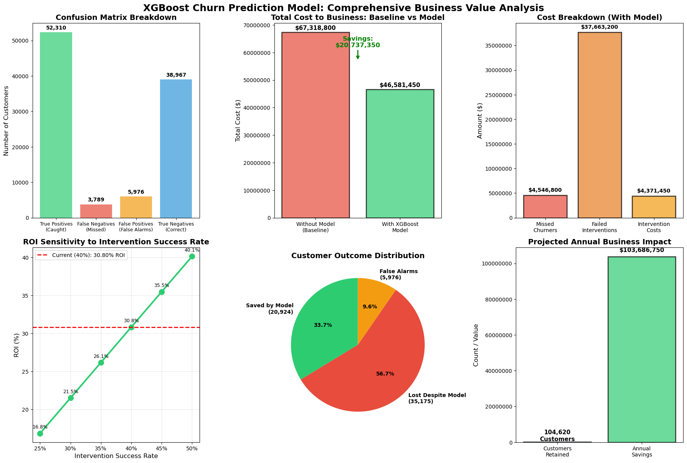

# 🚀 Customer Churn Prediction MLOps Project



> End-to-end MLOps pipeline for customer churn prediction using XGBoost, Great Expectations, MLflow, FastAPI, Streamlit, Docker, GitHub Actions, and AWS EC2.

---

# 📌 Project Overview

Customer churn is one of the most important business challenges for subscription-based companies. Retaining existing customers is significantly cheaper than acquiring new ones, making churn prediction a critical business problem.

This project predicts customer churn and demonstrates a complete machine learning lifecycle, from data validation and model training to cloud deployment and business impact analysis.

### Key Objectives

* Predict customers likely to churn
* Track experiments and model performance
* Validate data quality before training
* Deploy the model as a production-ready API
* Build an interactive frontend for predictions
* Automate testing and CI/CD workflows
* Deploy the application to AWS EC2
* Quantify business value and ROI

---

# 🏗️ Architecture


```text
Raw Data
    ↓
Great Expectations
    ↓
Feature Engineering
    ↓
XGBoost Training
    ↓
MLflow Tracking
    ↓
FastAPI API
    ↓
Docker Container
    ↓
GitHub Actions CI
    ↓
AWS EC2 Deployment
    ↓
Streamlit Frontend
```

---

# 📊 Streamlit User Interface


The application includes an interactive Streamlit dashboard where users can:

* Enter customer details
* Predict churn probability
* View risk level categorization
* Receive real-time predictions from the deployed API

### Features

* Interactive UI
* Real-time inference
* Risk classification
* Business-friendly output

---

# 🤖 Machine Learning Model

## Model Used

* XGBoost Classifier

## Performance Metrics

| Metric    | Score            |
| --------- | ---------------- |
| Accuracy  | ~90%             |
| Recall    | ~93%             |
| Precision | ~89% |
| F1 Score  | ~91.5% |


### Why Recall Matters

For churn prediction, missing a customer who is likely to leave can result in significant revenue loss. Therefore, recall was prioritized during model evaluation.

---

# 📈 MLflow Experiment Tracking



MLflow was used to:

* Track experiments
* Compare model runs
* Store metrics
* Log parameters
* Manage model artifacts

### Tracked Information

* Hyperparameters
* Accuracy
* Recall
* Precision
* F1 Score
* Model Artifacts

---

# ✅ Data Validation with Great Expectations



Data quality checks are implemented using Great Expectations.

### Validation Checks

* Missing values
* Data types
* Column existence
* Range checks
* Schema consistency

This ensures only valid data enters the training pipeline.

---

# 🌐 FastAPI Backend



The trained model is served through FastAPI.

## Endpoints

### Health Check

```http
GET /health
```

Response:

```json
{
  "status": "healthy"
}
```

### Prediction Endpoint

```http
POST /predict
```

Response:

```json
{
  "prediction": 1,
  "churn_probability": 0.6745
}
```

---

# 🐳 Docker Containerization



The application is fully containerized using Docker for portability and reproducibility.

### Build Image

```bash
docker build -t churn-api .
```

### Run Container

```bash
docker run -d \
-p 8000:8000 \
--name churn-api \
churn-api
```

### Benefits

* Consistent environments
* Simplified deployment
* Reproducibility
* Easy cloud deployment

---

# 🧪 Testing



Pytest is used to ensure application reliability.

### Test Coverage

* API tests
* Data validation tests
* Model tests
* Preprocessing tests

### Run Tests

```bash
pytest
```

### Example Output

```text
4 passed
```

---

# ⚙️ CI/CD Pipeline



GitHub Actions automatically:

* Installs dependencies
* Runs test suite
* Builds Docker image
* Verifies deployment readiness

### CI Workflow

```text
Push Code
    ↓
Install Dependencies
    ↓
Run Tests
    ↓
Build Docker Image
    ↓
Success
```

---

# ☁️ AWS EC2 Deployment



The application was deployed to AWS EC2 using Docker.

### Deployment Process

```text
GitHub Repository
        ↓
AWS EC2
        ↓
Docker Build
        ↓
Docker Run
        ↓
Public API
```

### AWS Services Used

* EC2
* Security Groups
* SSH Access
* Docker

---

# 🌍 Public API Deployment



The FastAPI service was successfully deployed and tested on AWS.

### Verification

* Health endpoint tested
* Prediction endpoint tested
* Public access confirmed

---

# 💰 Business Impact Analysis



The project translates machine learning predictions into measurable business value.

## Financial Assumptions

| Metric                    | Value  |
| ------------------------- | ------ |
| Customer Lifetime Value   | $1,200 |
| Retention Cost            | $75    |
| Intervention Success Rate | 40%    |

## Estimated Outcomes

| Metric                | Value   |
| --------------------- | ------- |
| Net Savings           | $20.7M  |
| Cost Reduction        | 30.8%   |
| Annualized Projection | $103.7M |

### Business Value

* Reduced customer loss
* Improved retention targeting
* Lower operational costs
* Higher ROI

---

# 📁 Repository Structure

```text
.
├── api/
├── artifacts/
├── configs/
├── data/
│   ├── raw/
│   ├── processed/
│   └── external/
├── docker/
├── mlruns/
├── notebooks/
├── src/
│   ├── data/
│   ├── features/
│   ├── models/
│   ├── pipelines/
│   └── utils/
├── tests/
├── streamlit_app.py
├── Dockerfile
├── requirements.txt
└── README.md
```

---

# 🛠️ Tech Stack

## Machine Learning

* XGBoost
* Scikit-learn
* Pandas
* NumPy

## MLOps

* MLflow
* Great Expectations
* Docker
* GitHub Actions

## Backend

* FastAPI
* Uvicorn

## Frontend

* Streamlit

## Cloud

* AWS EC2

## Testing

* Pytest

---

# 🚀 How To Run Locally

## Clone Repository

```bash
git clone <repository-url>
cd churn-prediction
```

## Install Dependencies

```bash
pip install -r requirements.txt
```

## Run FastAPI

```bash
uvicorn api.main:app --reload
```

## Run Streamlit

```bash
streamlit run streamlit_app.py
```

## Open Application

```text
http://localhost:8501
```

---

# 🎯 Recruiter Snapshot

This project demonstrates:

✅ Machine Learning

✅ Data Validation

✅ Experiment Tracking

✅ Model Evaluation

✅ FastAPI Development

✅ Streamlit Frontend

✅ Docker Containerization

✅ Automated Testing

✅ GitHub Actions CI/CD

✅ AWS Cloud Deployment

✅ Business ROI Analysis

---

# 👨‍💻 Author

**Nihal Siddiqui**

Aspiring Data Scientist | Machine Learning Engineer | MLOps Enthusiast

---

# 📜 License

This project is licensed under the MIT License.
